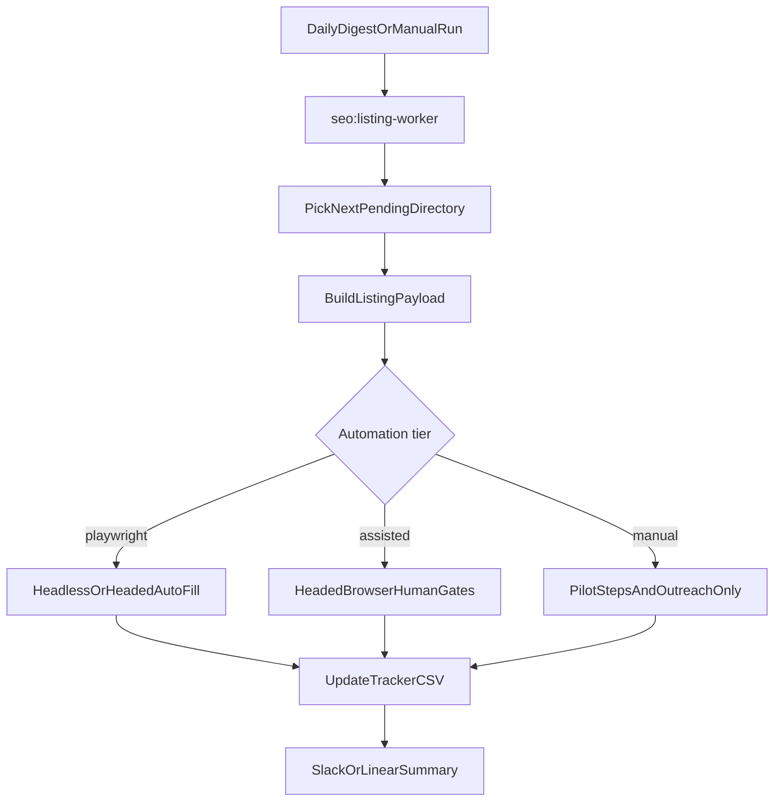

# Phase 1 — Directory listing worker

## Goal
Automate the boring parts of local directory submissions while keeping humans in control of login, CAPTCHA, membership paywalls, and final Submit clicks.

## What it replaces from Semrush
- “Submit to directories” task lists
- NAP consistency copy-paste
- Repeated form filling on chamber and citation sites

## What it does not replace
- Paid directory databases Semrush uses to discover sites
- Guaranteed acceptance on membership-only chambers

## Architecture



## Automation tiers

| Tier | Examples | Behavior |
|------|----------|----------|
| **playwright** | Brownbook, Cylex, Hotfrog | Saved login session → heuristic NAP fill → optional headed review |
| **assisted** | Canada411, Apple Business, HomeStars, Houzz, Barrie/Orillia Chamber | Headed browser → user logs in → agent fills NAP/description → user uploads/submits if needed |
| **manual** | GBP, membership-only flows | Payload + step guide + outreach email only |

## Human gates (never skip)
1. First-time login → `npm run seo:auth-save -- --id=<id>`
2. CAPTCHA / 2FA
3. Membership payment (chambers)
4. Final Submit click (until trust is proven)

## Commands

```bash
# Today's next directory task (markdown report)
npm run seo:listing-worker -- --report

# Assisted chamber/directory session (opens browser, fills NAP)
npm run seo:listing-worker -- --id=barrie-chamber --headed

# Playwright batch for easy free directories (after auth-save)
npm run seo:auto-submit -- --batch=easy --headed

# Mark completed after human submit
npm run seo:listing-worker -- --id=canada411 --mark-submitted --live-url=<url>
```

## Cursor Automation hook
Extend the daily SEO automation to run:

```bash
npm run seo:listing-worker -- --report
```

and post the “next directory action” block to Slack. Run `--headed` sessions manually on your machine, not in cloud cron.

## Success metrics
- Tracker rows move from `pending` → `submitted` → `live`
- `npm run seo:verify-listings` shows `verified: yes` for live URLs
- Fewer copy-paste errors on NAP fields

## Files
- [scripts/local-seo/listing-worker.ts](../scripts/local-seo/listing-worker.ts)
- [scripts/local-seo/listing-payload.ts](../scripts/local-seo/listing-payload.ts)
- [scripts/local-seo/playwright/](../scripts/local-seo/playwright/)
- [seo/listings-tracker.csv](../seo/listings-tracker.csv)
