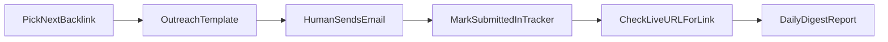

# Phase 4 — Backlink tracker and outreach

## Goal
Run a **realistic** backlink program: track targets, send outreach, verify wins — without pretending to crawl the whole web like Ahrefs/Semrush.

## What it replaces from Semrush
- Your own outreach queue
- Live link verification on known targets
- Chamber/partner/resource pitch templates

## What it does not replace
- Discovering every backlink on the internet
- Toxic link scoring at scale (needs Ahrefs/Semrush API or manual exports)

## Data model
- Directory rows: `seo/listings-tracker.csv` (`type=directory`)
- Backlink rows: same CSV (`type=backlink`) + [scripts/local-seo/backlink-targets.ts](../scripts/local-seo/backlink-targets.ts)

## Workflow



## Commands

```bash
# Next backlink + email template
npm run seo:listing-worker -- --backlink --report

# After partner agrees / link is live
npm run seo:listing-worker -- --id=barrie-chamber --mark-submitted --live-url=<url>
```

## Chamber example (Barrie)
1. Worker prints NAP + chamber outreach template
2. You join Barrie Chamber if required
3. Assisted session opens barriechamber.com → fill member directory fields
4. Mark tracker `live` with directory URL
5. `npm run seo:verify-listings` confirms NAP on live page

## Future enhancements
- Import Ahrefs/Semrush CSV exports into `seo/backlink-imports/`
- HTTP check that partner page links to money geo URL
- Monthly “new links won” section in digest

## Cursor Automation
Daily digest includes backlink queue; outreach sending stays human; verification runs weekly via `seo:verify-listings`.
